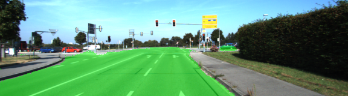
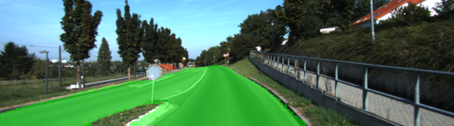
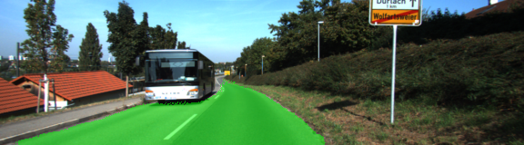
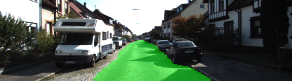
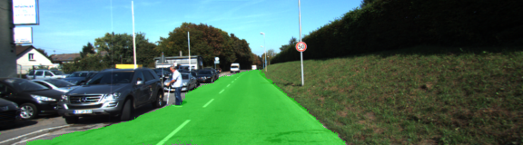
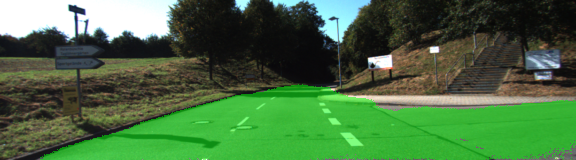
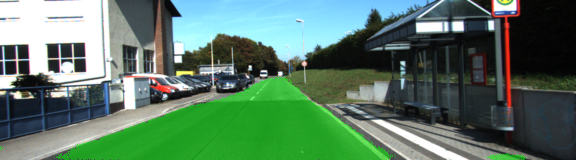
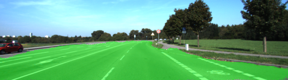
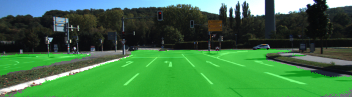
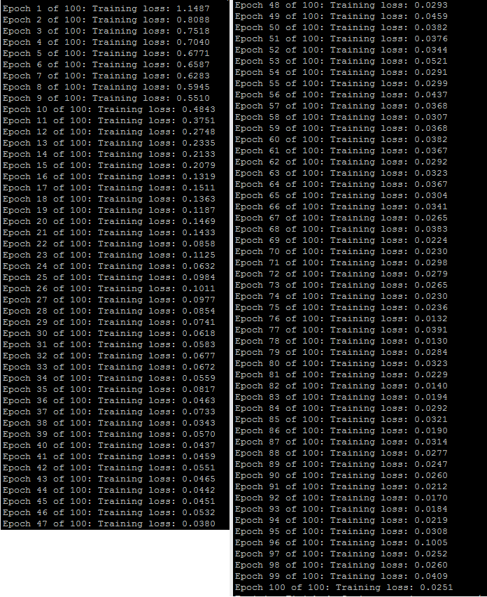

# Semantic Segmentation

In this project, I have labelled the pixels of a road in images using a Fully Convolutional Network (FCN). 
I've used the pretrained vgg16 model and trained the model to learn the correct features from the images. 
I have replaced fully connected layers with the 1x1 convolutional layers then added up-sampling by using transposed convolutional layers and 
skip connections to get better segmenatation results. I have tuned hyperparameters to optimize the neural network model. 
I have set the number of epochs and batch sizes to 100 and 5 respectively.
While training the model,I have observed decreased loss over time. 
Once the model built,it has generated inference images on Kitti Road dataset with correct label.

Image : The loss of the network while the network is training - 

 
